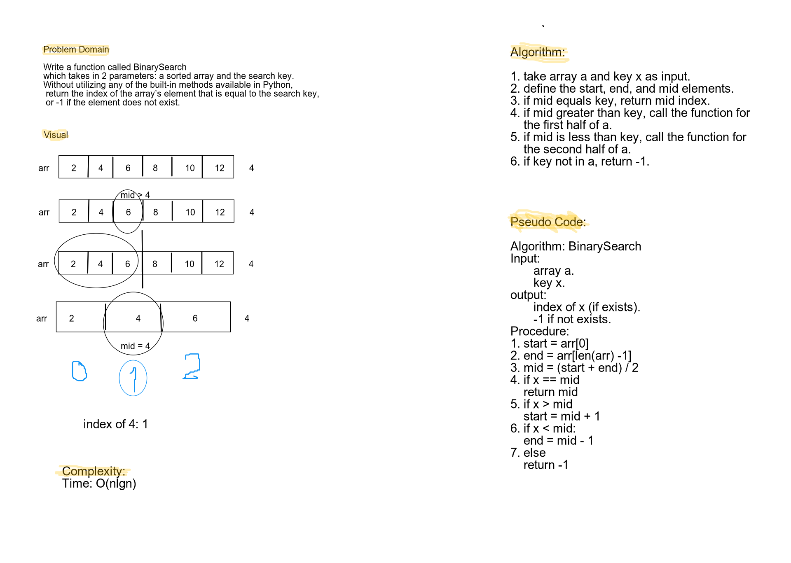

# Reverse an Array
Challenge3 that requires searching for an element index an array.

## Challenge
Write a function called BinarySearch which takes in 2 parameters: a sorted array and the search key. Without utilizing any of the built-in methods available in Python, return the index of the array’s element that is equal to the search key, or -1 if the element does not exist.

## Approach & Efficiency
Approach: I used an iterative approach that iterates through the array elements to search for an element index using the binary search method. 
Complexity: ***O(nlgn)***, where n is the number of elements in the array.

## Solution
