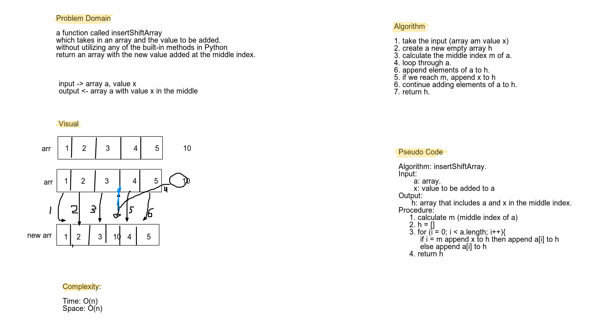

# Reverse an Array
Challenge12that requires inserting into the middle index of an array.

## Challenge
Write a function called insertShiftArray which takes in an array and the value to be added. Without utilizing any of the built-in methods available to your language, return an array with the new value added at the middle index.

## Approach & Efficiency
Approach: I used a **while** loop that iterates through the array elements. Then, adds the new value to a pre-calculated middle index of a new array.
Complexity: ***O(n)***, where n is the number of elements in the array.
User acceptance tests are included.
*insertShiftArray* test cases:

    1. [], 9 -> [9]

    2. [2], 4 -> [2, 4]

    3. [2, 1, 6, 7], 20 -> [2, 1, 20, 6, 7]

    4. [10, 20, 30], 15 -> [10, 20, 15, 30]

    5. [1, 2, 3, 4], "hello" -> [1, 2, "hello", 3, 4]

*removeShiftArray* test cases:

    1. []-> []

    2. [2] -> []

    3. [2, 1, 6, 7] -> [2, 1, 7]

    4. [10, 20, 30] -> [10, 30]
    
    5. [1, 2, "hello", 4], -> [1, 2, 4]

## Solution
