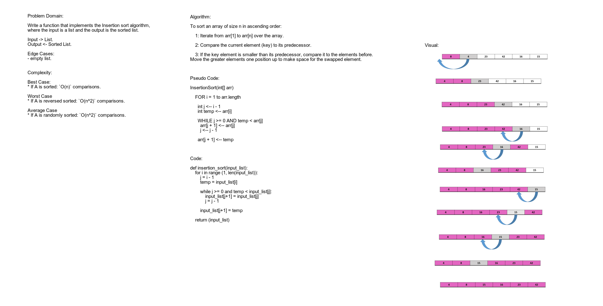

# Insertion Sort
Implement Insertion sort algorithm.

## Challenge
Write a function that implements the Insertion sort algorithm, where the input is a list and the output is the sorted list.

## Approach & Efficiency
Approach: I followed these steps: Iterated from arr[1] to arr[n] over the array, Compared the current element (key) to its predecessor, if the key element is smaller than its predecessor, compared it to the elements before. Move the greater elements one position up to make space for the swapped element.
Complexity: 
Best Case:
* If A is sorted: `O(n)` comparisons.

Worst Case
* If A is reversed sorted: `O(n^2)` comparisons.

Average Case
* If A is randomly sorted: `O(n^2)` comparisons.

## Solution
