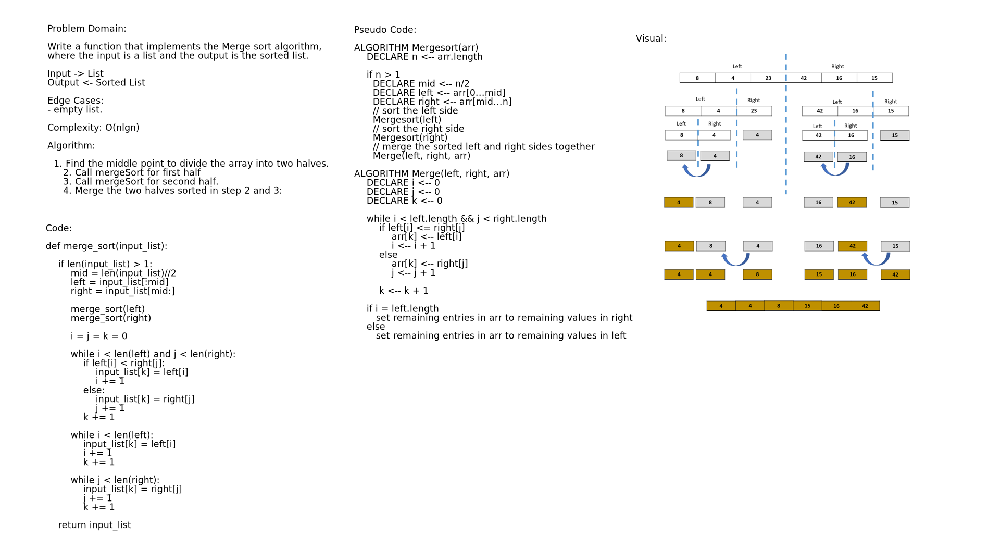

# Merge Sort
Implement Merge sort algorithm.

## Challenge
Write a function that implements the Merge sort algorithm, where the input is a list and the output is the sorted list.

## Approach & Efficiency
Approach: I followed these steps: Found the middle point to divide the array into two halves, called mergeSort for first half, called mergeSort for second half. Then, merged the two sorted halves.

## Complexity: 
`θ(nLogn)`, as it always divides the array into two halves and takes linear time to merge two halves.

## Solution
